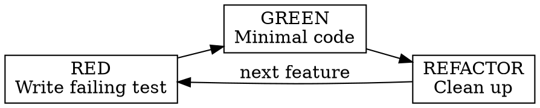

## Overview

Every skill is a directory with a required `SKILL.md` file at its root. The file has two parts: YAML frontmatter and a Markdown body. Supporting files live alongside `SKILL.md` in the same directory.

```
skills/
  skill-name/
    SKILL.md              # Main reference (required)
    supporting-file.md    # Only if needed
    scripts/              # Executable tools (optional)
```

## YAML frontmatter

The frontmatter is the first section of `SKILL.md`, delimited by `---`. It contains two required fields:

```yaml
---
name: skill-name-with-hyphens
description: Use when [specific triggering conditions and symptoms]
---
```

### The `name` field

- Must match the directory name
- Use letters, numbers, and hyphens only — no parentheses, spaces, or special characters
- 64-character maximum
- Use gerund form for processes: `test-driven-development`, `writing-skills`, `condition-based-waiting`

### The `description` field — the most important part

At startup, the agent loads `name` and `description` from every available skill. These two fields are the only information used to decide which skills to activate for a given task.

**The description must describe triggering conditions only.** Never summarize the skill's process or workflow — that creates a shortcut the agent will take instead of reading the skill body.

```yaml
# Bad: describes the workflow — agent may shortcut the skill body
description: Use when executing plans — dispatches subagent per task with code review

# Good: describes only when to trigger
description: Use when executing implementation plans with independent tasks

# Bad: vague, doesn't help the agent decide
description: For async testing

# Good: specific symptoms that signal this skill applies
description: Use when tests have race conditions, timing dependencies, or pass/fail inconsistently
```

**Format rules:**
- Start with "Use when..." to focus on triggering conditions
- Write in third person (it's injected into the system prompt)
- 1024-character maximum
- Include concrete symptoms, error messages, and situations
- Keep technology-agnostic unless the skill is technology-specific

## The Markdown body

After the frontmatter, the rest of `SKILL.md` is standard Markdown that the agent reads and follows.

A complete skill body follows this structure:

```markdown
---
name: test-driven-development
description: Use when implementing any feature or bugfix, before writing implementation code
---

# Test-Driven Development (TDD)

## Overview
Write the test first. Watch it fail. Write minimal code to pass.

**Core principle:** If you didn't watch the test fail, you don't know if it tests the right thing.

## When to Use
**Always:**
- New features
- Bug fixes
- Refactoring
- Behavior changes

## The Iron Law
NO PRODUCTION CODE WITHOUT A FAILING TEST FIRST

Write code before the test? Delete it. Start over.

## Common Rationalizations
| Excuse | Reality |
|--------|---------|
| "Too simple to test" | Simple code breaks. Test takes 30 seconds. |
| "Tests after achieve same goals" | Tests-after = "what does this do?" Tests-first = "what should this do?" |

## Red Flags — STOP and Start Over
- Code before test
- "I already manually tested it"
- "Tests after achieve the same purpose"
```

## Special XML tags

Skills use a small set of XML tags to communicate critical requirements to the agent.

### `<HARD-GATE>`

Blocks the agent from proceeding until an explicit condition is met. Used in the `brainstorming` skill to prevent implementation before design approval:

```markdown
<HARD-GATE>
Do NOT invoke any implementation skill, write any code, scaffold any project,
or take any implementation action until you have presented a design and the
user has approved it. This applies to EVERY project regardless of perceived simplicity.
</HARD-GATE>
```

### `<SUBAGENT-STOP>`

Tells dispatched subagents to skip the skill. Used in `using-superpowers` because session-establishment instructions shouldn't re-run inside subagent contexts:

```markdown
<SUBAGENT-STOP>
If you were dispatched as a subagent to execute a specific task, skip this skill.
</SUBAGENT-STOP>
```

### `<EXTREMELY-IMPORTANT>`

Highlights requirements so critical they need to stand out from the surrounding text:

```markdown
<EXTREMELY-IMPORTANT>
If you think there is even a 1% chance a skill might apply to what you are doing,
you ABSOLUTELY MUST invoke the skill.

IF A SKILL APPLIES TO YOUR TASK, YOU DO NOT HAVE A CHOICE. YOU MUST USE IT.
</EXTREMELY-IMPORTANT>
```

<Note>
These tags are conventions used by the Superpowers skill library. They work because agents trained on human text recognize patterns of emphasis and structural markers. They're not parsed by any framework.
</Note>

## Flowchart diagrams

Skills can include Graphviz dot diagrams for process flows. Use them only for non-obvious decision points where a visual would prevent the agent from going wrong.



**Use flowcharts for:**
- Non-obvious decision points
- Process loops where the agent might stop too early
- "When to use A vs B" decisions

**Never use flowcharts for:**
- Reference material (use tables or lists)
- Code examples (use fenced code blocks)
- Linear instructions (use numbered lists)
- Labels without semantic meaning (`step1`, `helper2`)

## Reference files

When supporting content is too large to keep inline, put it in a subdirectory and link to it from `SKILL.md`.

```
pdf/
├── SKILL.md              # Overview — loaded when triggered
├── FORMS.md              # Form-filling guide — loaded as needed
├── reference.md          # API reference — loaded as needed
└── scripts/
    ├── analyze_form.py   # Executed, not loaded into context
    └── validate.py
```

**Keep references one level deep.** Don't create chains like `SKILL.md → advanced.md → details.md`. The agent may only partially read nested references.

**Name files descriptively.** Use names that indicate content: `form_validation_rules.md`, not `doc2.md`.

**Structure long reference files with a table of contents** so the agent can see the full scope even when previewing partial content.

## File organization patterns

### Self-contained skill

All content fits in `SKILL.md`. No supporting files needed.

```
brainstorming/
  SKILL.md    # Everything inline
```

### Skill with reusable tool

A supporting file contains working code the agent can adapt or execute.

```
condition-based-waiting/
  SKILL.md    # Overview + patterns
  example.ts  # Working helpers to adapt
```

### Skill with heavy reference

Reference material too large for inline — API docs, comprehensive syntax guides.

```
pptx/
  SKILL.md       # Overview + workflows
  pptxgenjs.md   # 600-line API reference
  ooxml.md       # 500-line XML structure
  scripts/       # Executable tools
```

## Annotated real example: brainstorming skill

Here is the complete frontmatter from `skills/brainstorming/SKILL.md`, annotated:

```yaml
---
name: brainstorming
# ↑ Matches directory name: skills/brainstorming/

description: "You MUST use this before any creative work - creating features,
building components, adding functionality, or modifying behavior. Explores
user intent, requirements and design before implementation."
# ↑ Starts with strong trigger language. Lists specific triggering contexts.
# Does NOT describe the Socratic process or the checklist — that's in the body.
---
```

And the frontmatter from `skills/test-driven-development/SKILL.md`:

```yaml
---
name: test-driven-development
# ↑ Kebab-case, matches directory

description: Use when implementing any feature or bugfix, before writing implementation code
# ↑ Triggering condition only: "before writing implementation code"
# No mention of RED-GREEN-REFACTOR — that's in the body.
---
```

## Cross-referencing other skills

When one skill depends on another, reference by name — don't use `@` file links, which force-load the entire file immediately:

```markdown
# Good: named reference, agent decides when to load
**REQUIRED BACKGROUND:** You MUST understand superpowers:test-driven-development
before using this skill.

# Bad: force-loads the file, consuming context immediately
See @skills/test-driven-development/SKILL.md
```

<CardGroup cols={2}>
  <Card title="Writing Skills" icon="pen-tool" href="/contributing/writing-skills">
    How to write a skill from scratch using TDD principles
  </Card>
  <Card title="Testing Skills" icon="flask" href="/contributing/testing-skills">
    Verify your skill triggers correctly and holds under pressure
  </Card>
</CardGroup>
